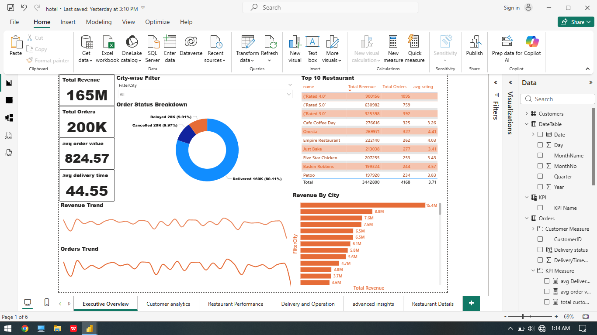
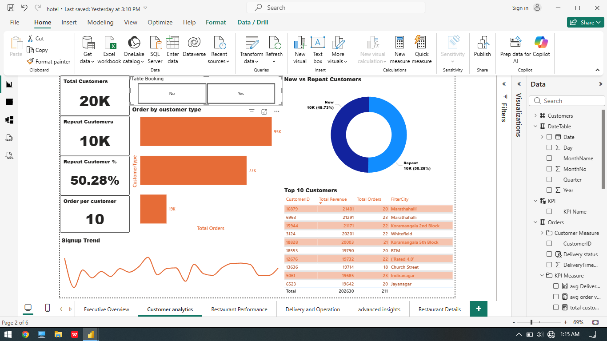
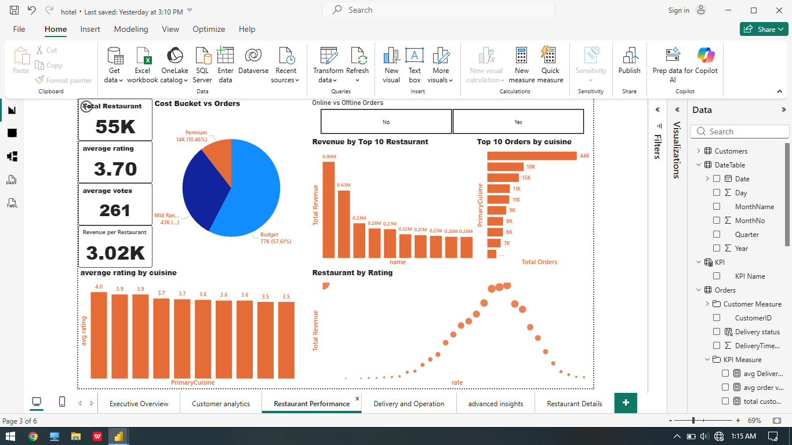
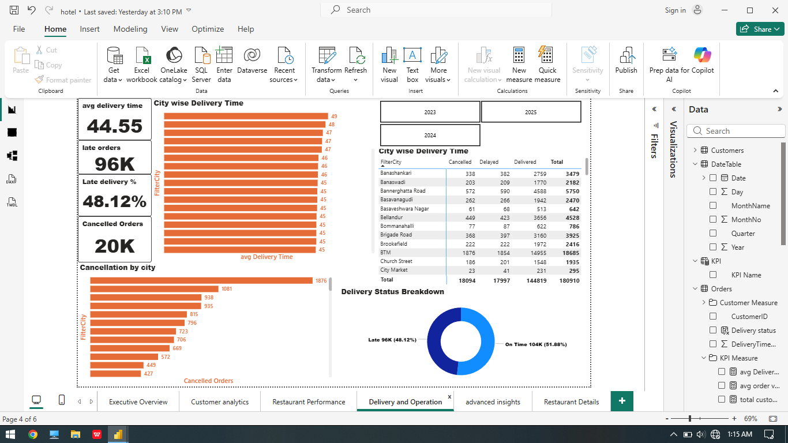
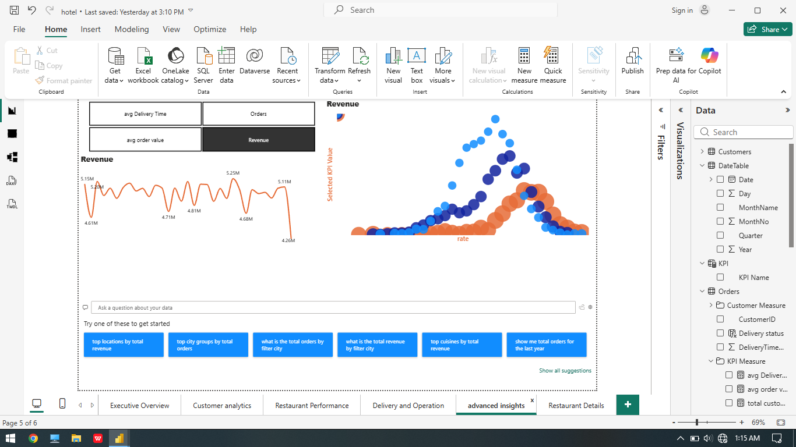
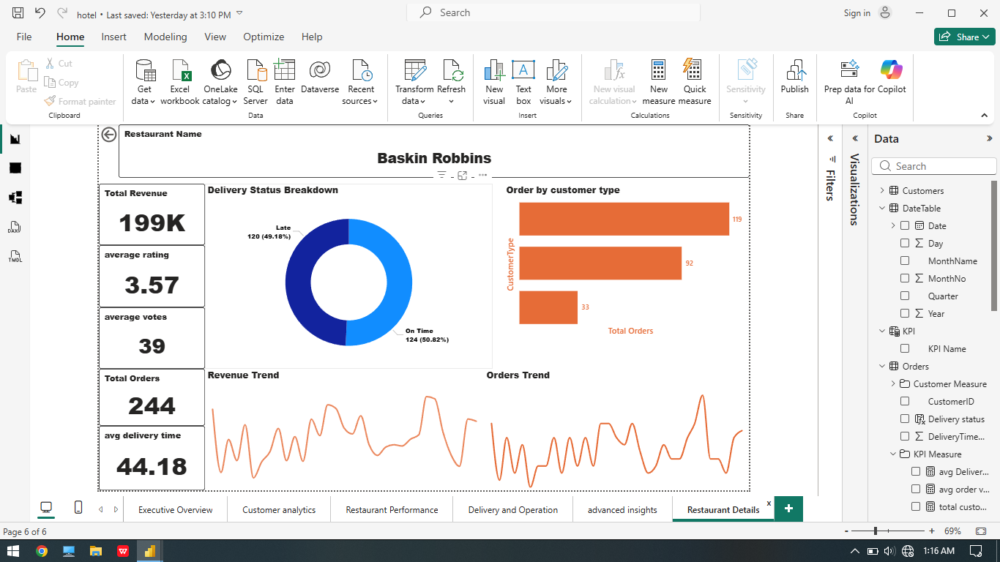

# 🍽️ Hotel & Restaurant Analytics Dashboard – Power BI Project

## 📌 Project Overview
This Power BI project analyzes restaurant and hotel operations data to uncover insights related to:

- Revenue performance
- Customer behavior
- Restaurant ratings
- Delivery operations
- Order trends
- City-wise performance
- Restaurant-level drill-through analysis

The dashboard is designed to help stakeholders monitor KPIs, identify operational issues, and improve customer experience using data-driven decisions.

---

# 📊 Dashboard Pages

## 1️⃣ Executive Overview
Provides a high-level summary of business performance.

### Key Metrics:
- Total Revenue
- Total Orders
- Average Order Value
- Average Delivery Time

### Insights Included:
- Revenue trends
- Orders trends
- Order status breakdown
- Top 10 restaurants
- City-wise revenue analysis

---

## 2️⃣ Customer Analytics
Analyzes customer behavior and engagement.

### Features:
- Repeat customer analysis
- Customer segmentation
- Signup trends
- Top customers by revenue
- New vs Repeat customers

### KPIs:
- Total Customers
- Repeat Customers
- Repeat Customer %
- Orders per Customer

---

## 3️⃣ Restaurant Performance
Focuses on restaurant ratings, cuisine performance, and revenue contribution.

### Insights:
- Revenue by top restaurants
- Orders by cuisine
- Rating distribution
- Cost bucket vs orders
- Average ratings by cuisine

### KPIs:
- Total Restaurants
- Average Rating
- Average Votes
- Revenue per Restaurant

---

## 4️⃣ Delivery & Operations
Tracks operational efficiency and delivery performance.

### Insights:
- City-wise delivery time
- Late deliveries
- Cancellation analysis
- Delivery status breakdown
- Order status by city

### KPIs:
- Average Delivery Time
- Late Orders
- Late Delivery %
- Cancelled Orders

---

## 5️⃣ Advanced Insights
Interactive page for deeper exploration using dynamic KPI selection and AI visuals.

### Features:
- KPI switching
- Trend analysis
- Distribution visualization
- AI-powered Q&A suggestions

---

## 6️⃣ Restaurant Details (Drill Through Page)
A dedicated drill-through dashboard for detailed restaurant-level analysis.

### Includes:
- Restaurant-specific KPIs
- Revenue performance
- Ratings & votes
- Order metrics
- Delivery insights
- Detailed operational breakdown

---

# 📌 Key Insights

- Generated **165M revenue** from **200K+ orders**
- Nearly **50% customers are repeat users**, showing strong customer retention
- Mid-range restaurants received the highest number of orders
- Restaurants with higher ratings generated better revenue performance
- Average delivery time was around **45 minutes**
- Almost **48% deliveries were late**, highlighting operational improvement areas
- Certain cities contributed significantly higher revenue than others
- Top restaurants and cuisines drove a major share of total sales

---

# 🛠️ Tools & Technologies Used

- Power BI
- DAX
- Power Query
- Data Modeling
- Interactive Visualizations

---

# 📈 Key Skills Demonstrated

- Data Cleaning & Transformation
- DAX Measures & KPIs
- Dashboard Design
- Data Modeling
- Drill-through Functionality
- Interactive Reporting
- Business Insight Generation

---

# 📷 Dashboard Preview

Add your screenshots in an `Images` folder.

Example:

---

# 📌 Conclusion

This Power BI project provides a comprehensive analysis of restaurant and hotel operations by combining customer, revenue, restaurant, and delivery insights into a single interactive dashboard.

The analysis revealed strong revenue generation and customer retention, while also identifying operational challenges such as high late deliveries and order cancellations. The dashboard enables stakeholders to monitor KPIs, identify business trends, and make data-driven decisions to improve overall performance and customer experience.
